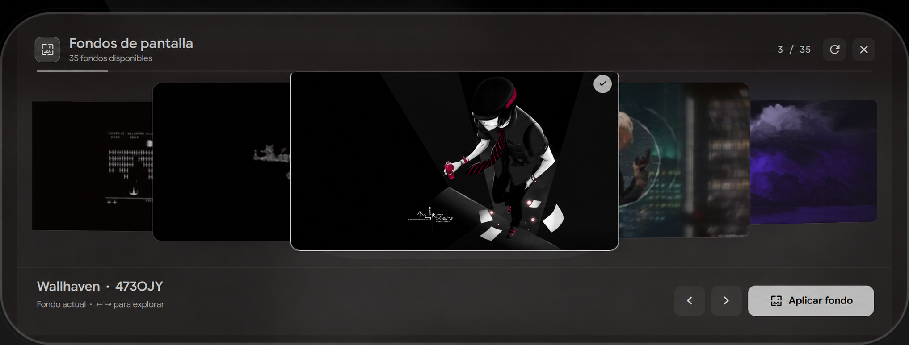
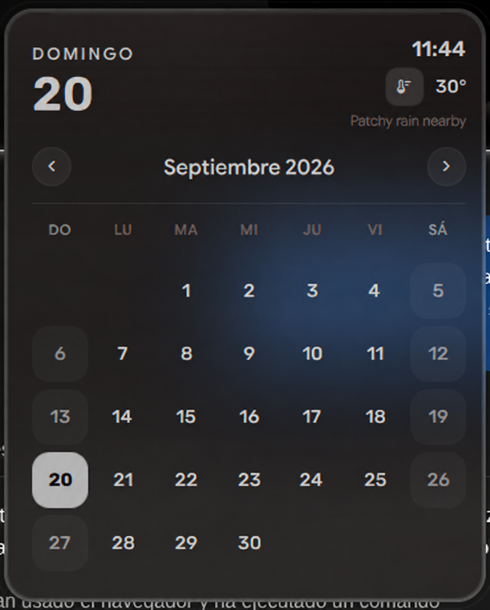
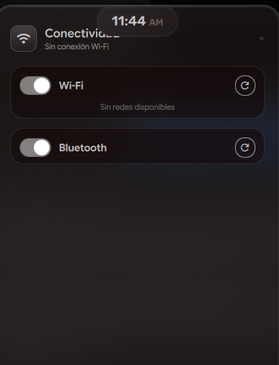

<div align="center">

# egaldidots

**A wallpaper-driven, pywal-synchronized Hyprland rice for CachyOS / Arch.**
Pick one wallpaper → the bar, menus, lock screen, terminal, editor,
notifications and fetch all recolor from it in one stroke.

[](https://cachyos.org)
[](https://hyprland.org)
[](./LICENSE)
[](#-how-the-theming-works)



<p align="center">
  
  
</p>

</div>

---

## 📑 Contents

- [What it is](#-what-it-is)
- [Features](#-features)
- [Requirements](#-requirements)
- [Installation](#-installation)
- [How the theming works](#-how-the-theming-works)
- [Repository structure](#-repository-structure)
- [Manual (sudo) steps — not done by the installer](#-manual-sudo-steps--not-done-by-the-installer)
- [Customizing](#-customizing)
- [Credits](#-credits)
- [License](#-license)

---

## 🧭 What it is

`egaldidots` is my personal dotfiles repo, built from my **CachyOS** setup. It
is a **single-source-of-truth rice**: exactly one daemon (`pywal16`) derives a
16-color palette from the active wallpaper, and every UI surface reads from that
palette — either directly (kitty, rofi, hyprland, hyprlock, waybar, swaync,
wlogout) or through a thin adapter (Starship prompt in fish, LazyVim statusline in
neovim, fastfetch). Change the wallpaper once and the whole desktop follows in
real time, even in already-open terminals.

`install.sh` reproduces the setup on a fresh Arch / CachyOS box: it installs
the dependency list **derived from what these configs actually use** (not a
generic bootstrap), backs up any pre-existing config with a timestamp, and
symlinks dotfiles into `$HOME` with **GNU Stow**, and generates the runtime assets
needed by Isla. System packages and services are managed through pacman/systemctl.

---

## ✨ Features

- **Hyprland** (modular config, `source`-split into `modules/`) with
  **hypridle** idle daemon. **Isla lockscreen** provides a wallpaper-blurred
  authentication card, profile/avatar, media and a pill-to-card transition.
  The previous hyprlock configuration remains available as a fallback.
- **pywal16** is the theming root. A custom wallpaper-picker script
  indexes `~/Wallpapers` by **dominant color** (via `magick`), buckets
  them across the spectrum and renders a searchable rofi menu with
  thumbnails. Select one → `awww` swaps it, pywal regenerates the
  palette, wpgtk rebuilds the GTK theme, and a `wal_sync_signal`
  universal-variable fans the recolor out to **every** surface live.
- **fish** + **Starship** with the 🎩 Isla signature, a two-line prompt,
  Git change counts, development environments, and compact command history.
  Every prompt color follows pywal; dark accents are mixed toward the palette's
  foreground until they reach 4.5:1 contrast against its background. Colors
  refresh live through `wal_sync_signal`, including the transient prompt.
- **kitty** with translucent blurred background, powerline tabs and pywal
  colors.
- **LazyVim** (neovim) heavily customized: pywal-synced statusline,
  satellite scrollbar, notify and dashboard (which renders the same ASCII
  hat as fastfetch), plus a network-engineering tilt (`cisco.vim`,
  `vim-fortios`), conform.nvim formatting (ruff/shfmt), navic breadcrumbs,
  mini.animate/indentscope, toggleterm.
- **waybar** ("dynamic-island" glass bar, active-workspace dot with a
  `breathe` keyframe), **rofi** (app launcher, clipboard, wallpaper-picker),
  **wlogout** (power menu) and **swaync** (notification dock) — all reading
  pywal colors.
- **Quickshell** is the current shell in `bar/`, with its QML components,
  surfaces and the `wpscan/` wallpaper plugin. The Waybar configuration stays
  in the repository as part of the previous rice and as a reference.
  Its optional user settings live in `~/.config/isla/shell.json`; copy
  `bar/shell.json.example` there to customize appearance without editing QML.
- **Fluid Island** adds a shared spring-based droplet engine: media lives to the
  right of the clock, while the session menu appears as a temporary left droplet.
  Interrupted transitions preserve motion; reduced motion resolves directly.
  Media headers are shared by the launcher, wallpaper picker and overview.
  Shared controls add finite icon animations, fixed hit targets and keyboard
  feedback. Session includes a profile header and four power actions; the
  authorization form handles sudo/Polkit retry, cancellation and success.
  See the [September 2026 changes](CHANGELOG.md),
  [shell architecture](docs/SHELL_ARCHITECTURE.md),
  [motion design](bar/fluid/MOTION_LANGUAGE.md) and
  [validation checklist](bar/TESTING.md).
- **fastfetch** with a custom Mario-style ASCII hat and nerd-font section
  separators.
- **micro** editor with Catppuccin color schemes; **bat** with a Catppuccin
  theme; `eza`/`zoxide`/`fzf`/`fd`/`rg` wired into fish.
- **Clipboard** persistence (`wl-clip-persist` + `cliphist`), **GNOME
  Keyring** secret store, **brightnessctl**, **hyprshot** screenshots,
  **playerctl** media control.
- An optional original hardware profile for the NVIDIA laptop docked to an
  external **240 Hz** monitor with **VRR**. Portable defaults enable all monitors.

---

## ✅ Requirements

- **Arch Linux or CachyOS** (or another `ID_LIKE=arch` derivative — Manjaro,
  EndeavourOS, Garuda…). `install.sh` detects this from `/etc/os-release`
  and **aborts** otherwise (override with `--force`, at your own risk).
- `pacman`; and **yay** or **paru** for the two AUR packages
  (`python-pywal16`, `wpgtk`). If neither is present the installer builds yay as the normal user.
- **GNU Stow** is installed automatically by the installer (`extra/stow`).
- Working GPU drivers and a Wayland-capable system. Portable defaults enable
  connected monitors. The original NVIDIA/dock profile is an explicit option.
- **Quickshell** with Qt >= 6.10 is needed for the animated icon paths.
  The installer includes Quickshell; the lockscreen uses hyprlock's PAM service.
- For the full look, install a Nerd Font: **JetBrainsMono Nerd Font** is in
  the dependency list (`ttf-jetbrains-mono-nerd`).

---

## 🚀 Installation and recovery

Start from an installed Arch/CachyOS system with working GPU drivers, internet,
a normal user with sudo access, and Git. This restores the desktop and tracked
application configuration; it does not install the operating system or recover
personal files, passwords, SSH keys or uncommitted changes.

```bash
git clone https://github.com/Edgardy715/egaldidots.git ~/egaldidots
cd ~/egaldidots
./install.sh
```

The installer upgrades the system, installs official/AUR dependencies (building
`yay` as the normal user if needed), backs up conflicting files, links dotfiles,
sets Isla to start in Hyprland, installs Fish plugins and the lockscreen launcher,
builds Wpscan against the installed Qt, restores locked Neovim plugins, builds
FlatColor GTK templates, seeds a wallpaper palette, enables network/audio
services, and selects Fish as the login shell. Mandatory failures stop the run.
Keep the checkout in place: configuration links reference it.

Log out and choose Hyprland in your existing display manager, or run `Hyprland`
from a TTY. Then validate the live session:

```bash
./install.sh --check
```

| Option | Effect |
| --- | --- |
| `--stow-only` | Restore configuration using dependencies already installed |
| `--deps-only` | Install and check required dependencies |
| `--check` | Check installed files, plugins, services and the active Isla session |
| `--wallpaper FILE` | Choose the initial wallpaper; otherwise reuse previous/bundled |
| `--hardware-profile portable` | Preferred modes for connected monitors (default) |
| `--hardware-profile original` | Original NVIDIA laptop/external 240 Hz monitor setup |
| `--keep-shell` | Preserve the current login shell |
| `--help` | Show usage |

Backups are stored in `~/.egaldidots-backup-*`. Unrelated files are preserved.
Custom monitor/GPU overrides belong in `~/.config/hypr/local.hardware.conf` and
survive a repeat installation unless a hardware profile is explicitly selected.
The old `--force` and `--no-backup` options are removed.

See [recovery and validation](docs/RECOVERY.md) for the supported boundary and tests.

---

## 🧬 How the theming works

The rice follows a strict **source vs. generated** split. Only `source` files
live in this repo; the `generated` layer is rebuilt on the fly and is never
committed.

```
 wallpaper.png ──awww──► ~/Wallpapers (symlinked from repo)
        │
        └─► pywal16 ──┬──► ~/.cache/wal/colors.sh        (the palette: color0..15, fg, bg)
                      ├──► ~/.cache/wal/colors-kitty.conf   (custom template in repo)
                      ├──► ~/.cache/wal/colors-rofi.rasi     (custom template in repo)
                      ├──► ~/.cache/wal/colors-hyprland.conf (pywal16 built-in template)
                      ├──► ~/.cache/wal/colors-hyprlock.conf (written by generate-rofi-theme.py)
                      ├──► ~/.cache/wal/colors-waybar.css    (read by waybar/swaync/wlogout via @import)
                      └──► ~/.cache/wal/colors.fish / colors-kitty.conf …
                              │
        wpgtk ─────────────► ~/.local/share/themes/FlatColor (GTK theme, regenerated)

        fish: __wal_apply_colors() ─► Starship pywal palette + fish_color_* (syntax)
              __wal_sync --on-variable wal_sync_signal ─► live recolor + repaint
        nvim: statusline/notify/satellite read ~/.cache/wal/colors
        fastfetch: colors block from pywal
```

- **Committed (source):** the configs under each package, two pywal templates
  (`wal/.config/wal/templates/colors-{kitty,rofi}`), and the Python/shell
  scripts in `hypr/.config/hypr/scripts/` that drive the picker, recolor and
  now-playing label.
- **Generated (never committed):** everything in `~/.cache/wal/`, the GTK
  `FlatColor` theme and wpgtk schemes/samples, and `~/.cache/starship/pywal.toml`.
- **Portability:** hardcoded home paths were removed. Hyprland/kitty use `~`
  expansion (`source = ~/.cache/...`, `include ~/.cache/...`), and GTK CSS
  files use relative `@import` (`../../.cache/wal/...`, `../../../.cache/wal/...`)
  so they resolve regardless of the username.

---

## 🗂 Repository structure

The dotfile package directories mirror their paths under
`$HOME` (so `hypr/.config/hypr/...` symlinks to `~/.config/hypr/...`).

```
egaldidots/
├── install.sh            # bootstrap (deps + backup + stow + fisher)
├── README.md  · LICENSE  · .gitignore
├── hypr/                 .config/hypr/  (hyprland.conf, modules/*.conf,
│                                        hyprlock.conf, hypridle.conf, scripts/)
├── waybar/               .config/waybar/ (config.jsonc, style.css, launch.sh)
├── bar/                  Quickshell shell (run with `quickshell -p bar`)
├── wpscan/               Qt/C++ wallpaper-scanner plugin used by the shell
├── rofi/                 .config/rofi/themes/  (launcher, clipboard, wallpaper-picker)
├── wlogout/             .config/wlogout/ (layout, style.css)
├── swaync/              .config/swaync/  (config.json, style.css)
├── kitty/              .config/kitty/   (kitty.conf → user.conf → pywal)
├── fish/               .config/fish/    (config.fish, fish_plugins)
├── starship/           .config/         (starship.toml, starship/pywal.py)
├── nvim/               .config/nvim/    (LazyVim: init.lua, lua/{config,plugins}/)
├── micro/              .config/micro/   (settings, catppuccin color schemes)
├── fastfetch/          .config/fastfetch/ (config.jsonc, hat.txt)
├── bat/                .config/bat/themes/ (Catppuccin Mocha)
├── wal/                .config/wal/templates/ (colors-kitty.conf, colors-rofi.rasi)
├── wpg/                .config/wpg/wpg.conf
├── gtk/                .config/{gtk-3.0,gtk-4.0}/gtk.css (filechooser bg)
├── thunar/             .config/{Thunar,xfce4}/ (custom actions, xfconf)
├── git/                .gitconfig
└── wallpapers/         Wallpapers/          (15 wallpapers, symlinked to ~/Wallpapers)
```

> **Fish / Starship:** `starship/.config/starship.toml` defines the prompt.
> `starship/.config/starship/pywal.py` reads `~/.cache/wal/colors.json` and
> atomically generates `~/.cache/starship/pywal.toml`. Fish selects it through
> `STARSHIP_CONFIG` at startup and on wallpaper changes. Without a valid pywal
> palette, the base configuration provides fallback colors. Existing shells
> need `exec fish` once after upgrading. Fisher manages fzf.fish; plugin
> functions/completions and `fish_variables` remain untracked.
>
> Check the adapter: `python3 starship/.config/starship/test_pywal.py`.
> Contrast is measured against pywal's background, not every pixel visible
> through a transparent terminal.

---

## 🔧 Manual (sudo) steps — not done by the installer

Optional bootloader/display-manager themes are installed separately:

- **GRUB theme — Elegant-grub2-themes** (`vinceliuice/Elegant-grub2-themes`):

  ```bash
  git clone https://github.com/vinceliuice/Elegant-grub2-themes.git
  cd Elegant-grub2-themes
  sudo ./install.sh -t whitesur        # theme name of your choice
  # then edit /etc/default/grub:  GRUB_THEME="/boot/grub/themes/.../theme.txt"
  sudo grub-mkconfig -o /boot/grub/grub.cfg
  ```

- **Wallpaper changes:** the installer seeds a palette automatically. Use
  Super+W in Isla, or `bash ~/.config/hypr/scripts/apply-wallpaper.sh IMAGE`,
  to update pywal, GTK and the live shell together.

---

## Isla lockscreen and authorization

Run the shell from this checkout with `quickshell -p bar`. Keep the checkout
in place while its installed launchers reference it. Hyprland starts Isla automatically; hyprlock remains the lockscreen fallback.

The main installer also installs the lockscreen launcher. To install it separately:

```sh
bash bar/lockscreen/install.sh
```

The script backs up an existing launcher and installs
`~/.local/share/quickshell-lockscreen/lock.sh` (or the XDG data directory).
Session, Super+L and hypridle use `~/.local/bin/isla-lock`, which resolves that launcher. It falls back to hyprlock if
Quickshell fails. Re-run the installer after moving the checkout.

The Fish Stow package includes the sudo askpass bridge. Open a new Fish session
and run Isla before using it; Polkit/PAM and sudo still validate credentials.
For setup, safe previews and checks, see [authentication](docs/AUTHENTICATION.md),
[lockscreen](docs/LOCKSCREEN_DESIGN.md) and [controls](docs/INTERACTION_SYSTEM.md).

---

## 🎨 Customizing

The shell provides validated settings and IPC to preview, discard and save changes.
See the [architecture and configuration contract](docs/SHELL_ARCHITECTURE.md).

- **Change the prompt structure** (modules, icons, spacing): edit
  `starship/.config/starship.toml`.
- **Change prompt colors:** they follow pywal. Adjust the `wal*` assignments in
  `starship.toml` or the contrast adjustment in `starship/.config/starship/pywal.py`.
- **Monitors / resolution / refresh rate:** `~/.config/hypr/local.hardware.conf`.
- **GPU overrides:** `~/.config/hypr/local.hardware.conf`; portable defaults avoid NVIDIA-specific environment variables.
- **Add wallpapers:** drop files into `wallpapers/Wallpapers/` (they're
  symlinked into `~/Wallpapers` by Stow, then `wal`/`awww` pick them up).

---

## 🙏 Credits

- [Hyprland](https://hyprland.org) — the compositor.
- [Starship](https://starship.rs) — the Fish prompt.
- [Lucide](https://lucide.dev) — vector icon paths; [ISC/Feather notices](docs/licenses/lucide.txt).
- [fzf.fish](https://github.com/patrickf1/fzf.fish) (patrickf1) — fzf integration for fish.
- [LazyVim](https://github.com/LazyVim/LazyVim) — the neovim distribution.
- [pywal16](https://github.com/eylles/pywal16) (eylles) — the 16-color fork of pywal that powers the palette.
- [wpgtk](https://github.com/deviantfero/wpgtk) (deviantfero) — wallpaper/GTK theming manager.
- [awww](https://codeberg.org/LGFae/awww) (LGFae) — the Wayland wallpaper daemon; successor to [swww](https://github.com/LGFae/swww).
- [adi1090x/rofi](https://github.com/adi1090x/rofi) — rofi theming base my clipboard theme builds on.
- [Elegant-grub2-themes](https://github.com/vinceliuice/Elegant-grub2-themes) (vinceliuice) — GRUB theme (manual install, see above).
- [Catppuccin](https://github.com/catppuccin/catppuccin) — fixed accents & editor themes.
- [Nerd Fonts](https://github.com/ryanoasis/nerd-fonts) (ryanoasis) — JetBrainsMono Nerd Font for the glyphs.

---

## 📜 License

MIT © 2026 [Edgardy715](https://github.com/Edgardy715) — see [LICENSE](./LICENSE).

